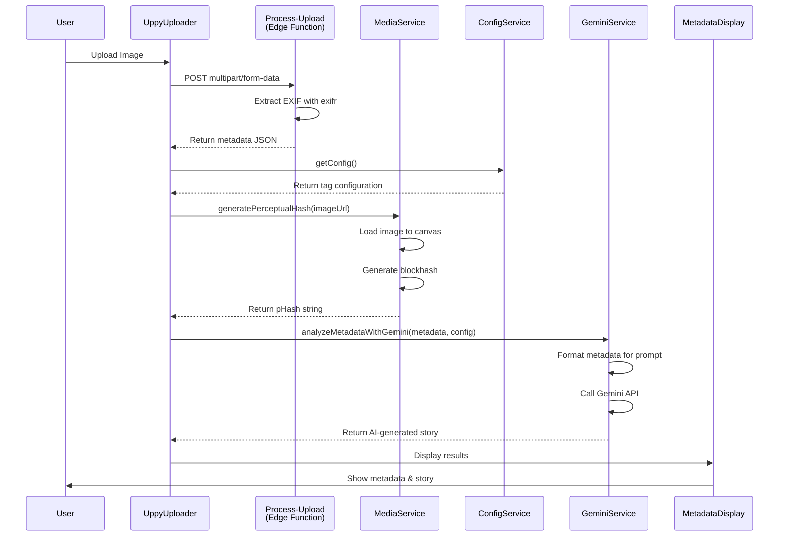
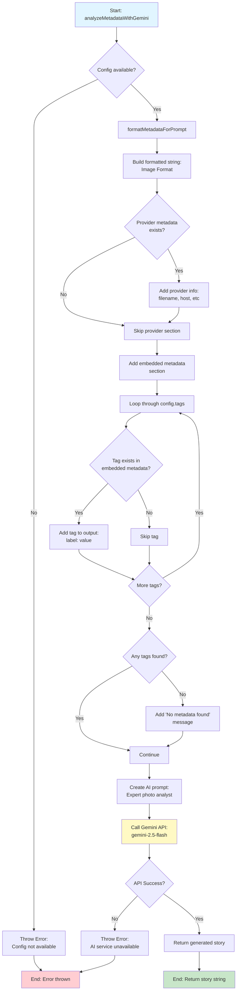
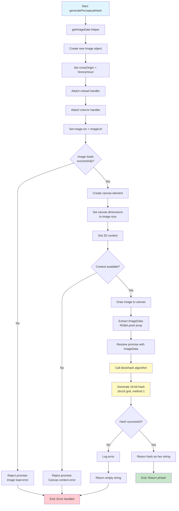
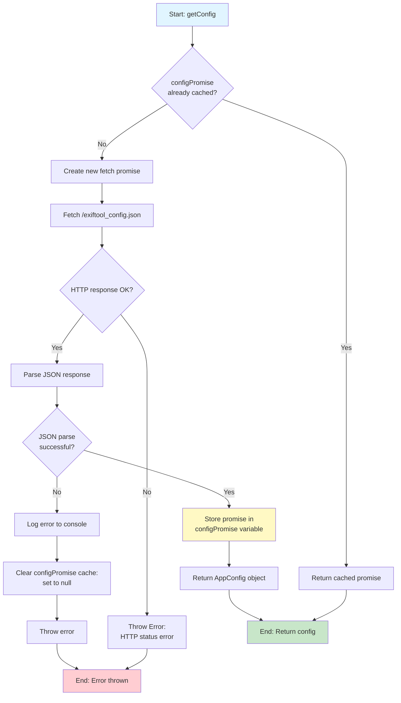
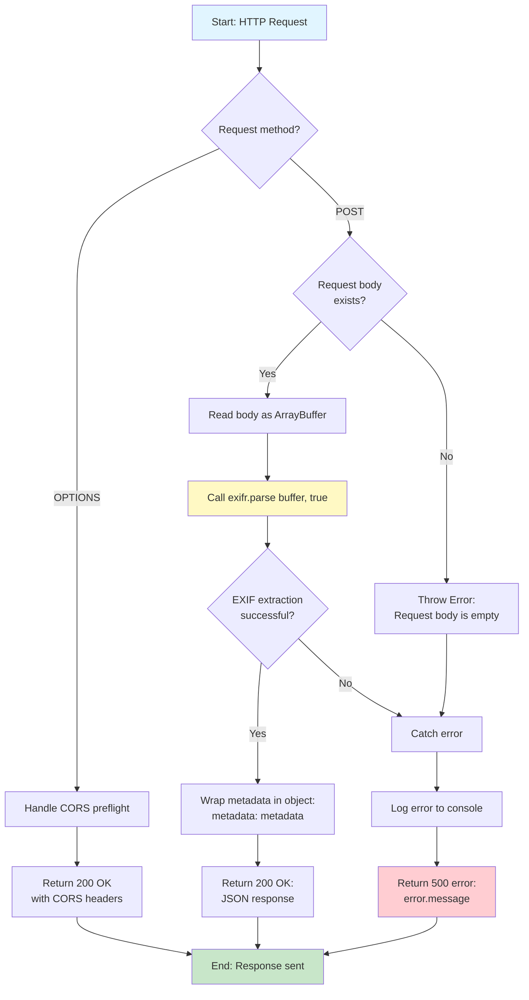
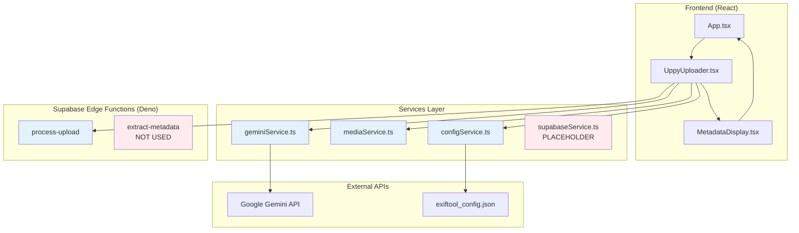
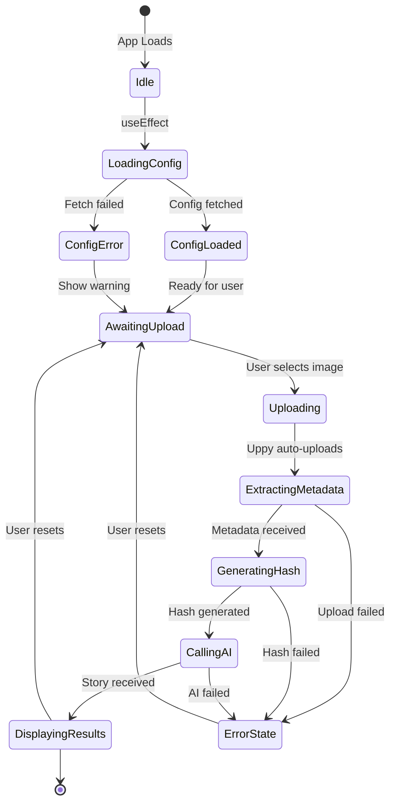
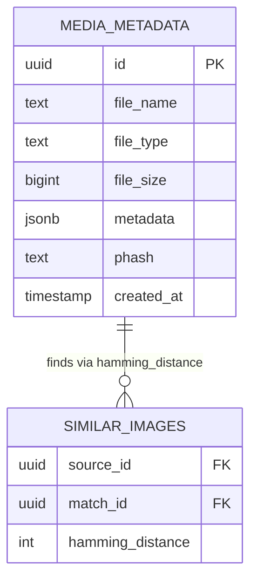
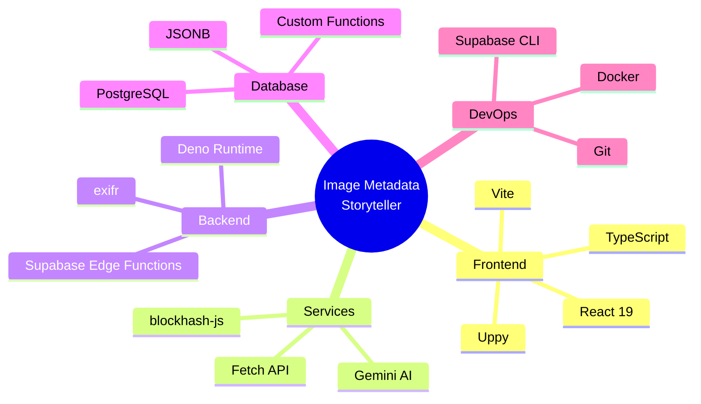

# Architecture Documentation

This document provides comprehensive flowcharts and diagrams for each service in the Image Metadata Storyteller application.

## Table of Contents

1. [Overall Application Flow](#overall-application-flow)
2. [Service Architecture](#service-architecture)
   - [Gemini Service](#gemini-service)
   - [Media Service](#media-service)
   - [Config Service](#config-service)
   - [Process-Upload Edge Function](#process-upload-edge-function)
   - [Extract-Metadata Edge Function](#extract-metadata-edge-function)
3. [Data Flow Diagrams](#data-flow-diagrams)

---

## Overall Application Flow



---

## Service Architecture

### Gemini Service

The Gemini Service handles AI-powered story generation from image metadata.



#### Exported Functions

- **`analyzeMetadataWithGemini(embeddedMetadata, providerMetadata, config, imageFormat)`**
  - **Input**: EXIF data, provider data, tag config, file format
  - **Output**: Promise<string> - AI-generated narrative story
  - **Purpose**: Generate creative stories from image metadata using Gemini AI

---

### Media Service

The Media Service handles client-side image processing and perceptual hash generation.



#### Exported Functions

- **`generatePerceptualHash(imageUrl)`**
  - **Input**: Image URL (blob, data, or HTTP URL)
  - **Output**: Promise<string> - Hexadecimal hash string
  - **Purpose**: Generate visual fingerprint for duplicate detection

---

### Config Service

The Config Service manages loading and caching of metadata tag configuration.



#### Exported Functions

- **`getConfig()`**
  - **Input**: None
  - **Output**: Promise<AppConfig> - Tag configuration object
  - **Purpose**: Load and cache EXIF tag definitions

#### Configuration Structure

```typescript
interface AppConfig {
  tags: Array<{
    key: string;      // EXIF tag identifier (e.g., "Make")
    label: string;    // Display name (e.g., "Camera Make")
    category: string; // Grouping (e.g., "camera", "location")
  }>;
}
```

---

### Process-Upload Edge Function

The main Edge Function for handling Uppy uploads and extracting metadata.

```mermaid
flowchart TD
    A[Start: HTTP Request] --> B{Request method?}

    B -->|OPTIONS| C[Handle CORS preflight]
    C --> D[Return 200 OK<br/>with CORS headers]

    B -->|POST| E[Parse FormData from body]
    E --> F{Field 'files[]'<br/>exists?}

    F -->|No| G[Throw Error:<br/>File not found in form data]
    F -->|Yes| H{File is valid<br/>not string?}
    H -->|No| G

    H -->|Yes| I[Convert file to ArrayBuffer]
    I --> J[Call exifr.parse buffer, true]

    J --> K{EXIF extraction<br/>successful?}
    K -->|No| L[Catch error]
    L --> M[Log error to console]
    M --> N[Return 500 error:<br/>Failed to process file]

    K -->|Yes| O[Return 200 OK:<br/>JSON metadata]

    D --> P[End: Response sent]
    O --> P
    N --> P
    G --> L

    style A fill:#e1f5ff
    style P fill:#c8e6c9
    style N fill:#ffcdd2
    style J fill:#fff9c4
```

#### Request/Response

**Request:**
```http
POST /functions/v1/process-upload
Content-Type: multipart/form-data; boundary=---...

------...
Content-Disposition: form-data; name="files[]"; filename="photo.jpg"
Content-Type: image/jpeg

<binary image data>
------...--
```

**Response (Success):**
```json
{
  "Make": "Canon",
  "Model": "EOS 5D Mark IV",
  "DateTimeOriginal": "2024:03:15 14:30:22",
  "GPSLatitude": 40.7128,
  "GPSLongitude": -74.0060,
  "ExposureTime": 0.008,
  "FNumber": 2.8,
  "ISO": 400
}
```

---

### Extract-Metadata Edge Function

Alternative Edge Function for raw binary uploads (not currently used).



#### Request/Response

**Request:**
```http
POST /functions/v1/extract-metadata
Content-Type: application/octet-stream

<raw binary image data>
```

**Response (Success):**
```json
{
  "metadata": {
    "Make": "Canon",
    "Model": "EOS 5D Mark IV",
    ...
  }
}
```

---

## Data Flow Diagrams

### Component Interaction



### State Management Flow



---

## Database Schema



### SQL Functions

```sql
-- Calculate Hamming distance between two perceptual hashes
CREATE FUNCTION hamming_distance(hash1 TEXT, hash2 TEXT)
RETURNS INTEGER
LANGUAGE plpgsql
AS $$
-- Implementation counts differing bits between two hex hashes
$$;
```

---

## Technology Stack



---

## Future Enhancements


### Planned Features

1. **Database Integration**: Enable `supabaseService.ts` to persist metadata
2. **Duplicate Detection**: Use perceptual hashes with Hamming distance
3. **User Accounts**: Track upload history per user
4. **Batch Upload**: Process multiple images simultaneously
5. **Advanced Filters**: Search by location, date, camera model
6. **Export Options**: Download metadata as CSV/JSON
7. **Realtime Updates**: WebSocket notifications for processing status
