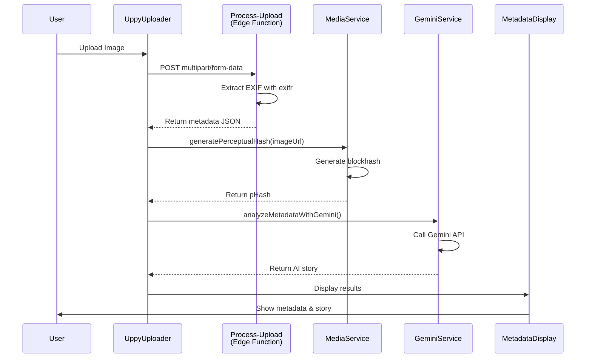
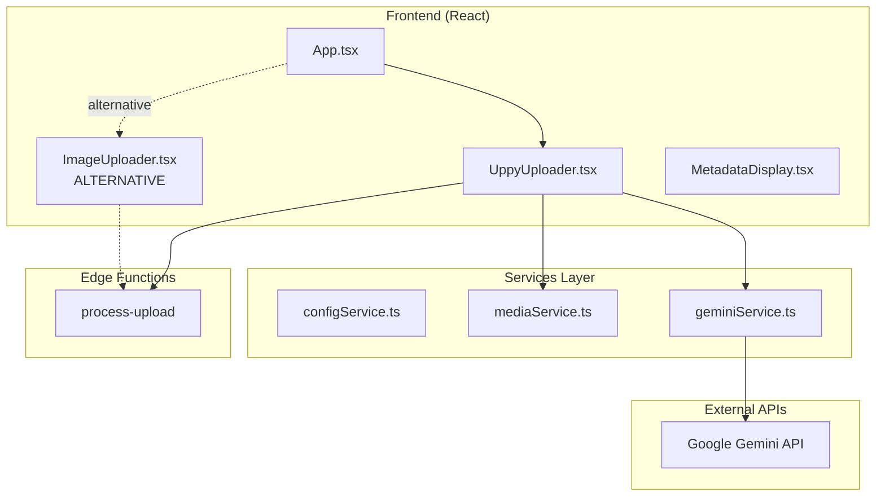

# Image Metadata Storyteller

A React application that extracts EXIF metadata from uploaded images and uses Google's Gemini AI to generate creative narrative stories based on the hidden data within your photos.

## Features

- 📸 **Image Upload**: Drag-and-drop image upload powered by Uppy
- 🔍 **Metadata Extraction**: Server-side EXIF metadata extraction from JPG, PNG, TIFF, and WEBP images
- 🎨 **Perceptual Hashing**: Client-side visual fingerprinting for future duplicate detection
- 🤖 **AI Story Generation**: Creative narratives generated by Google Gemini based on image metadata
- 💾 **Supabase Integration**: Edge Functions for serverless metadata processing

## Prerequisites

- **Node.js** (v18 or higher recommended)
- **Docker** (for local Supabase development)
- **Supabase CLI** (install via `npm install -g supabase`)
- **Google Gemini API Key** (get one at [aistudio.google.com](https://aistudio.google.com))

## Local Development

### 1. Install Dependencies
```bash
npm install
```

### 2. Configure Environment
Create a `.env.local` file in the project root:
```
GEMINI_API_KEY=your_gemini_api_key_here
```

### 3. Start Supabase (Required)
```bash
supabase start
```
This starts a local Supabase instance with PostgreSQL and Edge Functions on port 54321.

### 4. Run the App
```bash
npm run dev
```
The app will be available at [http://localhost:3000](http://localhost:3000)

## Project Structure

```
/
├── App.tsx                      # Main application component
├── components/
│   ├── UppyUploader.tsx         # File upload interface
│   ├── MetadataDisplay.tsx      # Metadata and story display
│   └── Icons.tsx                # SVG icons
├── services/
│   ├── geminiService.ts         # Google Gemini AI integration
│   ├── mediaService.ts          # Perceptual hash generation
│   ├── configService.ts         # Metadata configuration loader
│   └── supabaseService.ts       # Supabase client (stub)
├── supabase/
│   ├── functions/
│   │   ├── process-upload/      # Main metadata extraction endpoint
│   │   └── extract-metadata/    # Alternative extraction endpoint
│   └── migrations/              # Database schema migrations
├── metadata.json                # EXIF tag configuration
└── vite.config.ts              # Vite bundler configuration
```

## How It Works

1. User uploads an image via the Uppy interface
2. Image is posted to Supabase Edge Function (`process-upload`)
3. Server extracts EXIF metadata using the `exifr` library
4. Client generates a perceptual hash of the image
5. Metadata is sent to Google Gemini for creative story generation
6. Results are displayed in an interactive interface

### Application Flow Diagram



## Database Schema

The app includes migrations for a `media_metadata` table that can store:
- File information (name, type, size)
- EXIF metadata (JSON)
- Perceptual hashes for duplicate detection
- Hamming distance function for similarity comparison

## Build for Production

```bash
npm run build
```
Output will be in the `dist/` directory.

## Architecture & Services

This project features comprehensive service documentation with JSDoc comments for IntelliSense support. All exported functions are extensively documented with parameters, return types, examples, and usage patterns.

### Core Services

#### 🤖 Gemini Service (`services/geminiService.ts`)
Integrates with Google's Gemini AI to generate creative narrative stories from image metadata.

**Key Function:**
```typescript
analyzeMetadataWithGemini(
  embeddedMetadata: Record<string, any>,
  providerMetadata: Record<string, any> | undefined,
  config: AppConfig | null,
  imageFormat: string
): Promise<string>
```

#### 🖼️ Media Service (`services/mediaService.ts`)
Client-side perceptual hash generation for image fingerprinting and duplicate detection.

**Key Function:**
```typescript
generatePerceptualHash(imageUrl: string): Promise<string>
```
Generates a 64-bit perceptual hash using the blockhash algorithm (16-bit precision).

#### ⚙️ Config Service (`services/configService.ts`)
Loads and caches EXIF tag configuration with singleton pattern.

**Key Function:**
```typescript
getConfig(): Promise<AppConfig>
```
Fetches configuration once and caches for subsequent calls.

#### 🔧 Edge Functions (`supabase/functions/`)
- **process-upload**: Receives multipart uploads from Uppy, extracts EXIF metadata
- **extract-metadata**: Alternative endpoint for raw binary uploads

### Component Architecture



For comprehensive flowcharts, detailed service documentation, and data flow diagrams, see **[ARCHITECTURE.md](ARCHITECTURE.md)**.

## Technologies

- **Frontend**: React 19, TypeScript, Vite
- **File Upload**: Uppy (with native HTML5 alternative in ImageUploader)
- **AI**: Google Gemini 2.5 Flash
- **Backend**: Supabase Edge Functions (Deno)
- **Database**: PostgreSQL (via Supabase)
- **Image Processing**: exifr, blockhash-js

## License

MIT

## AI Studio

This project was scaffolded from Google AI Studio. View the original app at: https://ai.studio/apps/drive/19DcgZ9yN-Afb8vXOCHdy_wcMhEHdapEy
